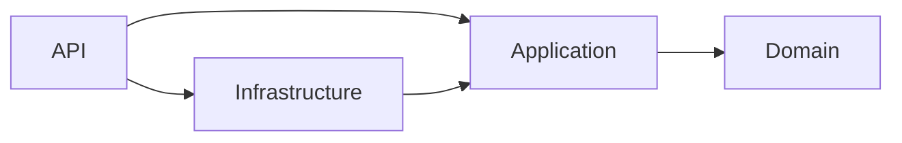

# Reading the partner forum code

Start with a single request rather than trying to memorise every folder. This guide
explains the runtime flow, language conventions, each source file and the configuration.
The source comments focus on purpose and decisions; generated files and JSON formats
are explained here instead of inserting comments that tools could reject or overwrite.

For running the completed app, use [the README](../README.md).

## Trace a new post from the screen to SQL Server

1. `App.tsx` selects `CreatePost.tsx` for `/new`.
2. The form builds title/body values and calls `createPost` in `api/postsApi.ts`.
3. The shared `api.ts` sends JSON to `/api/v1/posts`, attaching the in-memory bearer token.
4. During development Vite forwards that request to ASP.NET on port 5088.
5. Authentication validates the token. Authorization requires a signed-in user.
6. `PostsController.CreatePost` takes the author ID from the claims and delegates to `IPostService`.
7. `PostService` trims and validates the content, builds a Domain `Post`, and calls `IPostRepository`.
8. `PostRepository` uses `AppDbContext` to save it. SQL Server assigns the numeric ID.
9. The controller returns 201, a Location header and `{ "id": 12 }` as a `CreatedResourceDto`.
10. React navigates to `/posts/12`; `PostDetail.tsx` retrieves the saved post and its comments.

Runtime calls can travel out to Infrastructure because dependency injection supplies
an implementation of the Application-owned interface. That does not mean Application
references the Infrastructure project. The distinction between runtime calls and
compile-time dependencies is central to understanding this design.

These arrows show direct project references, not HTTP or SQL traffic. Domain has no
project dependencies. API's Infrastructure reference is used to compose the application.
The React frontend is an HTTP client, not another backend project.

## What the common terms mean in this code

| Term | Meaning here |
|---|---|
| Entity | A business/persistence object such as Post or Comment; EF maps it to stored data |
| DTO | A request/response data shape, such as CreatePostDto or PostResponseDto |
| Interface | A contract naming operations, without choosing the database or other implementation |
| Service | Coordinates a use case and applies validation/rules |
| Repository | Implements the data access operations that a use case needs |
| Dependency injection | Startup registration tells ASP.NET which implementation to construct for an interface |
| Scoped | One instance per DI scope, normally an HTTP request; appropriate for EF DbContext |
| Singleton | One instance for the host lifetime; used for the stateless token generator/configuration |
| `record` | A concise C# data type used for these DTOs, with value-based equality semantics |
| `Task<T>` / `await` | An asynchronous result; database/HTTP I/O can be awaited without blocking the request thread |
| `CancellationToken ct` | Carries request cancellation down to asynchronous database operations that accept it |
| `string?` | A string that may be null; anonymous readers have no viewer ID |
| `IQueryable` | A query description EF can translate to SQL when executed |
| `AsNoTracking()` | Avoids tracking read-only entities for later updates |
| `Select` projection | Requests the response fields needed by the client instead of exposing entity graphs |
| `Skip` / `Take` | Applies the requested offset and page size in the query |
| `ThenBy` | Breaks sorting ties so consecutive pages use a stable order |
| Migration | A reviewed schema change generated from EF's model |
| Model snapshot | EF's generated record of the model after the last migration, used for future diffs |
| Claim | Signed token information such as user ID or role, validated before use |
| 401 / 403 | Authentication is missing/invalid / authenticated caller lacks permission |
| 409 | The action conflicts with a rule or existing data, such as duplicate liking |
| Props | Inputs a React parent passes to a child component |
| State | Values React retains between renders, such as the comment draft |
| Context | A way to share session state without passing it through every component |
| Query | A server read cached by React Query |
| Mutation | A server write, followed here by refreshing affected cached queries |
| Query key | Identifies a cache entry; includes the filters and viewer where response data depends on them |
| Controlled form | Parent state owns the input value; submission failure can retain the draft |
| `[Fact]` | A single xUnit test case |
| `[Theory]` / `[InlineData]` | Multiple input examples for one test behaviour |
| Arrange / Act / Assert | Set up the scenario, perform the action, check its observable outcome |
| Test double | A small substitute such as RecordingPosts, used to test a use case without SQL |

## Read the important flows next

**Login:** AuthController → AuthService → Identity password verification → JwtTokenGenerator.
The frontend stores the returned token in memory. Server-side checks protect actions;
UI visibility is only a usability aid. Logging out clears the browser session and cache,
but does not revoke a copied JWT before expiry.

**Like:** PostsController → PostService → ownership rule → PostRepository → composite
SQL key. Two simultaneous attempts cannot bypass the key. The UI disables an already
liked/own-post button, but a direct API client is still subject to the same rules.

**Flag:** the moderator role is checked by ASP.NET before the service runs. The service
accepts the fixed warning label and persists the authenticated moderator and timestamp.
Regular users cannot grant themselves that role during registration.

**Browse:** URL parameters → PostFilters/Discussions → GetPosts DTO validation → SQL
filters → total count → deterministic ordering and paging → response projection. Comments
use their own page and chronological ordering; they do not implement all post filters.

**Errors:** expected service/domain failures are translated in middleware. Malformed
request binding also produces HTTP errors through ASP.NET's API controller behaviour.
The frontend displays an error and retains form input where appropriate. A 401 for
an authenticated request clears the in-memory session and query cache.

**Tests:** unit tests use plain rules or a recording repository. Integration tests host
ASP.NET in-process and create a unique real SQL Server database per fixture, then drop
only that database. Frontend tests use a simulated DOM and mock HTTP where needed;
they do not prove a live browser/database flow by themselves.

## Backend source map

Each entry links to the current file. Short DTOs need only one purpose comment;
services and adapters also explain the decisions inside their methods.

| File | Responsibility |
|---|---|
| [Forum.Domain/Entities/Post.cs](../src/backend/Forum.Domain/Entities/Post.cs) | A discussion and its related comments, likes and moderation records. Database mapping stays in Infrastructure. |
| [Forum.Domain/Entities/Comment.cs](../src/backend/Forum.Domain/Entities/Comment.cs) | A response to one post. AuthorId links to an account without making Domain depend on ASP.NET Identity. |
| [Forum.Domain/Entities/Like.cs](../src/backend/Forum.Domain/Entities/Like.cs) | One user liking one post. Infrastructure maps this pair to a composite key to prevent duplicate likes. |
| [Forum.Domain/Entities/ModerationTag.cs](../src/backend/Forum.Domain/Entities/ModerationTag.cs) | Records the fixed warning label together with who applied it and when, so moderation is auditable. |
| [Forum.Domain/Entities/UserRole.cs](../src/backend/Forum.Domain/Entities/UserRole.cs) | The two business roles. RoleNames maps them to the existing Identity and JWT role strings. |
| [Forum.Domain/Rules/ForumRules.cs](../src/backend/Forum.Domain/Rules/ForumRules.cs) | Reusable business validation with no HTTP or database dependency; failures are translated by the API. |
| [Forum.Domain/Exceptions/ForumException.cs](../src/backend/Forum.Domain/Exceptions/ForumException.cs) | Describes an expected failure using a domain category. HTTP status codes are chosen in the outer API layer. |
| [Forum.Application/Services/PostService.cs](../src/backend/Forum.Application/Services/PostService.cs) | Coordinates post use cases through repository interfaces; validates input and applies rules before persistence. |
| [Forum.Application/Services/CommentService.cs](../src/backend/Forum.Application/Services/CommentService.cs) | Validates comment input and the parent post before asking a repository to read or save comments. |
| [Forum.Application/Interfaces/Repositories/IPostRepository.cs](../src/backend/Forum.Application/Interfaces/Repositories/IPostRepository.cs) | The persistence operations post use cases need. SQL Server and test doubles implement the same contract. |
| [Forum.Application/Interfaces/Repositories/ICommentRepository.cs](../src/backend/Forum.Application/Interfaces/Repositories/ICommentRepository.cs) | The comment persistence boundary; callers do not need an EF context or knowledge of SQL. |
| [Forum.Application/Interfaces/Services/IPostService.cs](../src/backend/Forum.Application/Interfaces/Services/IPostService.cs) | The post use cases exposed to controllers; authenticated identities are passed separately from request bodies. |
| [Forum.Application/Interfaces/Services/ICommentService.cs](../src/backend/Forum.Application/Interfaces/Services/ICommentService.cs) | The comment use cases exposed to controllers, with cancellation propagated to database work. |
| [Forum.Application/Interfaces/Services/IAuthService.cs](../src/backend/Forum.Application/Interfaces/Services/IAuthService.cs) | Application-owned authentication contract; Infrastructure supplies the Identity-backed implementation. |
| [Forum.Application/Interfaces/Services/IJwtTokenGenerator.cs](../src/backend/Forum.Application/Interfaces/Services/IJwtTokenGenerator.cs) | Token-creation contract using plain DTOs; JWT signing types remain in Infrastructure. |
| [Forum.Application/Exceptions/RequestValidationException.cs](../src/backend/Forum.Application/Exceptions/RequestValidationException.cs) | Carries grouped validation messages; API middleware turns them into a Validation Problem Details response. |
| [Forum.Application/Enums/SortByOptions.cs](../src/backend/Forum.Application/Enums/SortByOptions.cs) | Internal sort choices. PostService translates the public newest/oldest/likes query strings into these values. |
| [Forum.Application/Dtos/CreatedResourceDto.cs](../src/backend/Forum.Application/Dtos/CreatedResourceDto.cs) | Returns the numeric ID after creating a post or comment. It carries a result; it does not save data. |
| [Forum.Application/Dtos/Page.cs](../src/backend/Forum.Application/Dtos/Page.cs) | A bounded result set plus total matching count; Total is not just the number of items on this page. |
| [Forum.Application/Dtos/Auth/AuthResponseDto.cs](../src/backend/Forum.Application/Dtos/Auth/AuthResponseDto.cs) | Successful login result: a bearer token, its expiry and the safe identity information the UI needs. |
| [Forum.Application/Dtos/Auth/CurrentUserDto.cs](../src/backend/Forum.Application/Dtos/Auth/CurrentUserDto.cs) | Public session identity. It deliberately excludes passwords, password hashes and Identity internals. |
| [Forum.Application/Dtos/Auth/LoginRequestDto.cs](../src/backend/Forum.Application/Dtos/Auth/LoginRequestDto.cs) | Credentials submitted for password verification; this request is never returned as the login response. |
| [Forum.Application/Dtos/Auth/RegisterRequestDto.cs](../src/backend/Forum.Application/Dtos/Auth/RegisterRequestDto.cs) | Public registration input has no role field; callers cannot request moderator access. |
| [Forum.Application/Dtos/Auth/RegisterResponseDto.cs](../src/backend/Forum.Application/Dtos/Auth/RegisterResponseDto.cs) | Confirms the created account identity. The frontend then logs in through the separate login endpoint. |
| [Forum.Application/Dtos/Posts/AuthorResponseDto.cs](../src/backend/Forum.Application/Dtos/Posts/AuthorResponseDto.cs) | A value/label pair for the author filter: the stable account ID and its display name. |
| [Forum.Application/Dtos/Posts/CreatePostDto.cs](../src/backend/Forum.Application/Dtos/Posts/CreatePostDto.cs) | Content for a new post. The controller supplies author identity from validated claims, not this payload. |
| [Forum.Application/Dtos/Posts/ModerationTagResponseDto.cs](../src/backend/Forum.Application/Dtos/Posts/ModerationTagResponseDto.cs) | The visible warning and its audit information, including the moderator name and UTC timestamp. |
| [Forum.Application/Dtos/Posts/PostQueryParametersDto.cs](../src/backend/Forum.Application/Dtos/Posts/PostQueryParametersDto.cs) | Public post retrieval options. Defaults bound the result size; From is inclusive and To is exclusive. |
| [Forum.Application/Dtos/Posts/PostResponseDto.cs](../src/backend/Forum.Application/Dtos/Posts/PostResponseDto.cs) | A read model projected for the UI, including counts and whether the current viewer has already liked it. |
| [Forum.Application/Dtos/Posts/TagPostDto.cs](../src/backend/Forum.Application/Dtos/Posts/TagPostDto.cs) | Optional moderation payload. The service accepts only this fixed label, not arbitrary user-defined tags. |
| [Forum.Application/Dtos/Comments/CreateCommentDto.cs](../src/backend/Forum.Application/Dtos/Comments/CreateCommentDto.cs) | Comment text only; the route supplies the post ID and authenticated claims supply the author ID. |
| [Forum.Application/Dtos/Comments/CommentResponseDto.cs](../src/backend/Forum.Application/Dtos/Comments/CommentResponseDto.cs) | Comment data returned to readers, without exposing the persistence entity or account credentials. |
| [Forum.Infrastructure/Entities/User.cs](../src/backend/Forum.Infrastructure/Entities/User.cs) | Identity manages password hashes, roles and lockout; this adapter adds the forum display name. |
| [Forum.Infrastructure/Configuration/JwtSettings.cs](../src/backend/Forum.Infrastructure/Configuration/JwtSettings.cs) | Shared signing configuration used by both token generation and bearer validation. |
| [Forum.Infrastructure/DependencyInjection.cs](../src/backend/Forum.Infrastructure/DependencyInjection.cs) | Registers database and authentication adapters at startup; the inner layers never reference this helper. |
| [Forum.Infrastructure/Repositories/PostRepository.cs](../src/backend/Forum.Infrastructure/Repositories/PostRepository.cs) | Implements post persistence with EF Core. Filtering, paging, projection and uniqueness handling happen here. |
| [Forum.Infrastructure/Repositories/CommentRepository.cs](../src/backend/Forum.Infrastructure/Repositories/CommentRepository.cs) | Executes bounded chronological comment queries and persists new comments through EF Core. |
| [Forum.Infrastructure/Data/AppDbContext.cs](../src/backend/Forum.Infrastructure/Data/AppDbContext.cs) | EF model combining Identity tables and forum entities; indexes and constraints protect stored data. |
| [Forum.Infrastructure/Data/DbInitializer.cs](../src/backend/Forum.Infrastructure/Data/DbInitializer.cs) | Development/test setup: applies migrations and adds fictional accounts and sample discussions when needed. |
| [Forum.Infrastructure/Data/AppDbContextFactory.cs](../src/backend/Forum.Infrastructure/Data/AppDbContextFactory.cs) | Lets dotnet ef construct the model without starting the web host; uses the same SQL Server provider. |
| [Forum.Infrastructure/Services/AuthService.cs](../src/backend/Forum.Infrastructure/Services/AuthService.cs) | Implements local password authentication using Identity rather than custom hashing or an external provider. |
| [Forum.Infrastructure/Services/JwtTokenGenerator.cs](../src/backend/Forum.Infrastructure/Services/JwtTokenGenerator.cs) | Signs identity and role claims; a signed JWT is verifiable by the API but is not encrypted. |
| [Forum.Api/Controllers/ApiControllerBase.cs](../src/backend/Forum.Api/Controllers/ApiControllerBase.cs) | Provides claim-derived identity helpers shared by controllers. ApiController enables API model-binding conventions. |
| [Forum.Api/Controllers/AuthController.cs](../src/backend/Forum.Api/Controllers/AuthController.cs) | Maps versioned authentication routes to the authentication service and HTTP responses. |
| [Forum.Api/Controllers/PostsController.cs](../src/backend/Forum.Api/Controllers/PostsController.cs) | Handles HTTP routing and access control; delegates post business operations to Application. |
| [Forum.Api/Controllers/CommentsController.cs](../src/backend/Forum.Api/Controllers/CommentsController.cs) | Comments are nested under a post route. Reads are public; creation requires a validated user. |
| [Forum.Api/Controllers/HealthController.cs](../src/backend/Forum.Api/Controllers/HealthController.cs) | Confirms the API process can answer a request. This endpoint does not check database readiness. |
| [Forum.Api/Exceptions/CustomExceptionMiddleware.cs](../src/backend/Forum.Api/Exceptions/CustomExceptionMiddleware.cs) | Central HTTP error translation so controllers do not repeat try/catch blocks or expose unexpected exceptions. |
| [Forum.Api/Extensions/ServiceCollectionExtensions.cs](../src/backend/Forum.Api/Extensions/ServiceCollectionExtensions.cs) | Wires Application services in the API composition root, keeping DI framework references out of Application. |
| [Forum.Api/Program.cs](../src/backend/Forum.Api/Program.cs) | Composition root: registers dependencies, orders middleware, maps controllers and optionally seeds local data. |

## Frontend source map

| File | Responsibility |
|---|---|
| [main.tsx](../src/forum-web/src/main.tsx) | Starts React and supplies shared query caching, routing and authentication to the component tree. |
| [App.tsx](../src/forum-web/src/App.tsx) | Defines page routes and the shared header. Page components handle their own data and forms. |
| [api.ts](../src/forum-web/src/api.ts) | Shared HTTP client and response shapes. Feature API modules reuse it for token headers and error handling. |
| [auth.tsx](../src/forum-web/src/auth.tsx) | Owns the in-memory session and clears cached server state when identity changes or expires. |
| [auth-context.ts](../src/forum-web/src/auth-context.ts) | Describes the session operations exposed to components without coupling them to token storage. |
| [useAuth.ts](../src/forum-web/src/useAuth.ts) | Reads the session context and fails clearly if a component was rendered outside AuthProvider. |
| [pages/Discussions.tsx](../src/forum-web/src/pages/Discussions.tsx) | Coordinates URL-based post filters, sorting and paging; delegates rendering to PostFilters and PostRow. |
| [pages/PostDetail.tsx](../src/forum-web/src/pages/PostDetail.tsx) | Coordinates one discussion, paged comments and authenticated mutations; child components render the controls. |
| [pages/Login.tsx](../src/forum-web/src/pages/Login.tsx) | Shared login/registration form. Registration creates an account, then uses the normal login endpoint. |
| [pages/CreatePost.tsx](../src/forum-web/src/pages/CreatePost.tsx) | Requires a local session, submits content and navigates using the ID returned by CreatedResourceDto. |
| [components/LikeButton.tsx](../src/forum-web/src/components/LikeButton.tsx) | Displays like eligibility from props. Disabled controls improve UX; the API independently enforces the rules. |
| [components/shared.tsx](../src/forum-web/src/components/shared.tsx) | Reusable accessible error and paging controls; their parent owns fetching and page state. |
| [components/posts/PostFilters.tsx](../src/forum-web/src/components/posts/PostFilters.tsx) | Loads author choices and submits validated filter values to its parent without fetching posts itself. |
| [components/posts/PostRow.tsx](../src/forum-web/src/components/posts/PostRow.tsx) | Renders a discussion preview and refreshes the post list after a successful like. |
| [components/comments/CommentForm.tsx](../src/forum-web/src/components/comments/CommentForm.tsx) | Controlled form: the parent owns the draft and clears it only after the API confirms success. |
| [components/comments/CommentList.tsx](../src/forum-web/src/components/comments/CommentList.tsx) | Renders supplied comment data. Paging and HTTP requests stay in the detail page. |
| [components/moderation/ModerationTagControl.tsx](../src/forum-web/src/components/moderation/ModerationTagControl.tsx) | Shows the flag action only for moderators on unflagged posts; server-side authorization remains essential. |
| [api/authApi.ts](../src/forum-web/src/api/authApi.ts) | Authentication endpoints using the shared HTTP client; identity storage remains the AuthProvider responsibility. |
| [api/postsApi.ts](../src/forum-web/src/api/postsApi.ts) | Typed post and author requests. All paths are relative to the shared /api/v1 client. |
| [api/commentsApi.ts](../src/forum-web/src/api/commentsApi.ts) | Comment requests scoped to a post, with ten comments requested per frontend page. |
| [api/moderationApi.ts](../src/forum-web/src/api/moderationApi.ts) | Sends the fixed moderation action; the server supplies the moderator identity and timestamp. |
| [auth.test.tsx](../src/forum-web/src/auth.test.tsx) | Verifies that an authenticated 401 clears the session, cached data and token used by subsequent requests. |
| [pages/Login.test.tsx](../src/forum-web/src/pages/Login.test.tsx) | Exercises a failed login through the form so its error and retained input are observable to the user. |
| [components/LikeButton.test.tsx](../src/forum-web/src/components/LikeButton.test.tsx) | Checks permission states and click behaviour through the button rendered to the user. |
| [components/shared.test.tsx](../src/forum-web/src/components/shared.test.tsx) | Checks paging boundaries so users cannot navigate before the first or beyond the final page. |
| [components/posts/PostFilters.test.tsx](../src/forum-web/src/components/posts/PostFilters.test.tsx) | Checks reversed dates and that applying a filter resets paging while preserving the chosen sort. |
| [components/comments/CommentForm.test.tsx](../src/forum-web/src/components/comments/CommentForm.test.tsx) | Checks that failure preserves the draft and that pending submission disables another submit. |
| [components/moderation/ModerationTagControl.test.tsx](../src/forum-web/src/components/moderation/ModerationTagControl.test.tsx) | Checks visibility by role/flag state and the eligible moderator action. |
| [test-setup.ts](../src/forum-web/src/test-setup.ts) | Adds DOM matchers and cleans rendered trees between tests so component tests do not share mounted UI. |

## Backend test map

| File | Responsibility |
|---|---|
| [Forum.UnitTests/Domain/ForumRulesTests.cs](../tests/Forum.UnitTests/Domain/ForumRulesTests.cs) | Pure rule tests need no web host or database. Theory inputs exercise several examples of the same behaviour. |
| [Forum.UnitTests/Application/PostServiceTests.cs](../tests/Forum.UnitTests/Application/PostServiceTests.cs) | A recording repository verifies what the use case attempts to save without opening a database connection. |
| [Forum.IntegrationTests/ForumFactory.cs](../tests/Forum.IntegrationTests/ForumFactory.cs) | Runs the real API in-process against a uniquely named SQL Server database for each fixture. |
| [Forum.IntegrationTests/ForumTestBase.cs](../tests/Forum.IntegrationTests/ForumTestBase.cs) | Shared setup helpers create authenticated clients and sample posts; individual tests state the behaviour under test. |
| [Forum.IntegrationTests/ControllerContractTests.cs](../tests/Forum.IntegrationTests/ControllerContractTests.cs) | Checks model-binding errors and the Location header returned after post creation. |
| [Forum.IntegrationTests/Authentication/AuthenticationTests.cs](../tests/Forum.IntegrationTests/Authentication/AuthenticationTests.cs) | Exercises public reads, authenticated writes and registration boundaries through real HTTP requests. |
| [Forum.IntegrationTests/Authentication/TokenAndLockoutTests.cs](../tests/Forum.IntegrationTests/Authentication/TokenAndLockoutTests.cs) | Verifies rejected signatures, expired tokens and account lockout using the real authentication pipeline. |
| [Forum.IntegrationTests/Authentication/RateLimitTests.cs](../tests/Forum.IntegrationTests/Authentication/RateLimitTests.cs) | Uses an isolated host fixture so earlier authentication calls cannot consume this test's rate-limit allowance. |
| [Forum.IntegrationTests/Posts/PostsTests.cs](../tests/Forum.IntegrationTests/Posts/PostsTests.cs) | Checks post validation, not-found responses, filtering and deterministic pagination against SQL Server. |
| [Forum.IntegrationTests/Comments/CommentsTests.cs](../tests/Forum.IntegrationTests/Comments/CommentsTests.cs) | Checks bounded retrieval of comments through the API and real database adapter. |
| [Forum.IntegrationTests/Likes/LikesTests.cs](../tests/Forum.IntegrationTests/Likes/LikesTests.cs) | Exercises ownership and duplicate rules, including concurrent requests that must not create two likes. |
| [Forum.IntegrationTests/Moderation/ModerationTests.cs](../tests/Forum.IntegrationTests/Moderation/ModerationTests.cs) | Checks role restrictions, duplicate flags and the persisted moderation audit visible to readers. |

## Configuration, generated files and supporting artifacts

| File / directory | What it controls and how to work with it |
|---|---|
| [ForumApi.sln](../src/backend/ForumApi.sln) | Groups the four backend projects and two test projects for builds/tests |
| Each `.csproj` | Target framework, package dependencies and project-reference boundaries |
| [Directory.Build.props](../Directory.Build.props) | Enables NuGet lockfiles across the solution |
| Each `packages.lock.json` | Resolved NuGet graph; restore tooling maintains it, not explanatory comments |
| [.config/dotnet-tools.json](../.config/dotnet-tools.json) | Pins the repository's EF command-line tool; restore with `dotnet tool restore` |
| [appsettings.json](../src/backend/Forum.Api/appsettings.json) | Shared host/JWT configuration; no production signing secret is checked in |
| [appsettings.Development.json](../src/backend/Forum.Api/appsettings.Development.json) | Local SQL Server connection and demo setup values |
| [launchSettings.json](../src/backend/Forum.Api/Properties/launchSettings.json) | IDE launch profiles; README commands use explicit URLs and no launch profile |
| [DependencyInjection.cs](../src/backend/Forum.Infrastructure/DependencyInjection.cs) | Validates config and registers SQL Server, Identity and JWT services |
| [Data/Migrations](../src/backend/Forum.Infrastructure/Data/Migrations) | Generated migration operations, metadata and snapshot; review, but do not casually edit an applied migration |
| [compose.yaml](../compose.yaml) | Dedicated local SQL Server container, loopback port, health check and persistent volume |
| [package.json](../src/forum-web/package.json) | Frontend dependencies and dev/build/lint/test scripts; requires Node 24 |
| [package-lock.json](../src/forum-web/package-lock.json) | Resolved npm graph; `npm ci` reproduces it without choosing new versions |
| [vite.config.ts](../src/forum-web/vite.config.ts) | React development build and API proxy from port 5173 to 5088 |
| [vitest.config.ts](../src/forum-web/vitest.config.ts) | Simulated DOM test environment and shared setup |
| [tsconfig.json](../src/forum-web/tsconfig.json), [tsconfig.app.json](../src/forum-web/tsconfig.app.json), [tsconfig.node.json](../src/forum-web/tsconfig.node.json) | TypeScript project boundaries and compiler checks |
| [index.html](../src/forum-web/index.html) | Browser shell containing the root where React mounts |
| [index.css](../src/forum-web/src/index.css) | Shared controls, list/detail layouts, error/success feedback, mobile breakpoints and reduced-motion rules |
| [.gitignore](../.gitignore) | Excludes build outputs, dependencies, local databases, environment files and editor-local settings |
| [Forum.postman_collection.json](../postman/Forum.postman_collection.json) | 20 runnable requests, scripts, descriptions and synthetic response examples |
| [Local.postman_environment.json](../postman/Local.postman_environment.json) | Forum Local base URL; tokens remain collection-script variables |
| [walkthrough.md](walkthrough.md) | Demo sequence, trade-offs, limitations and verification evidence |
| `bin/`, `obj/`, `node_modules/`, `dist/` | Generated build/install output; inspect source instead and do not commit these |

JSON documents do not allow ordinary comments. Their explanation belongs in this guide
or their supported description fields. EF-generated files have tooling-maintained
structure; new explanations were added to the model/configuration rather than altering
historical migration code. No business behaviour was changed for these learning notes.

## A short self-check while reading

- Can you explain why `CreatedResourceDto` is a response and `CreatePostDto` is a request?
- Can you trace where the authenticated author ID comes from?
- Can you explain why a duplicate like must be rejected by SQL as well as the UI?
- Can you show which code would change for another database and which code would stay?
- Can you explain why a successful comment refreshes data but a failed one retains text?
- Can you distinguish a unit test, an API/database integration test and a browser walkthrough?

You do not need to memorise every line. Being able to follow these decisions and verify
them in the code is more useful than reading comments aloud.
